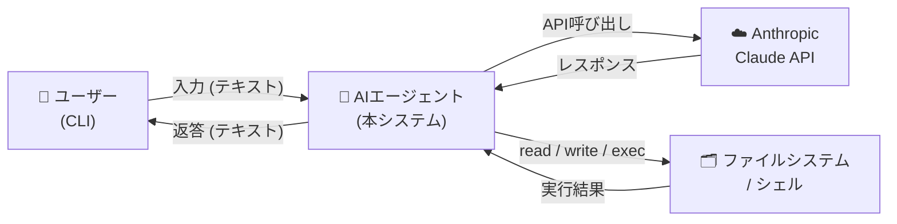
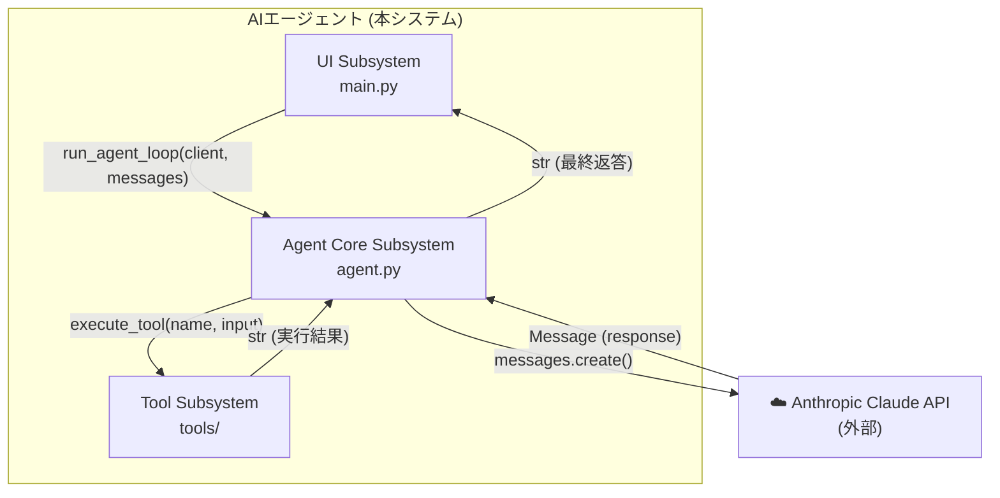
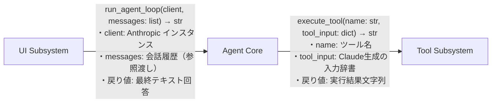
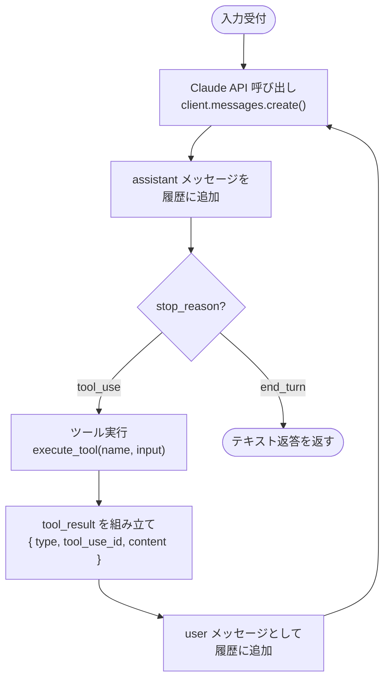
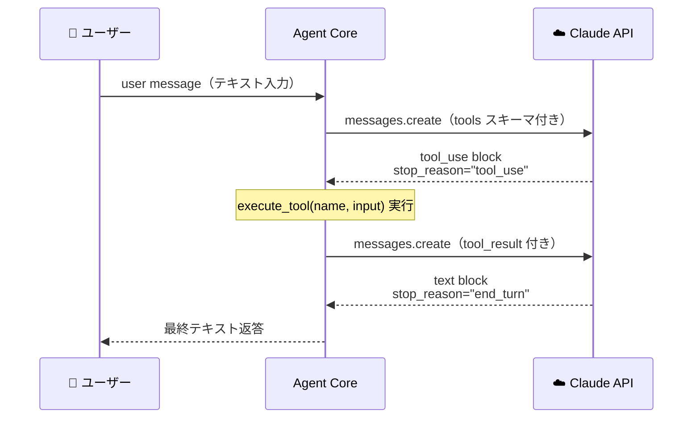

# アーキテクチャ設計書: 汎用AIエージェント

**バージョン**: v1.1
**最終更新**: 2026-03-17

## この文書で把握できること

| 問い | 答えが書いてある箇所 |
|------|---------------------|
| システムは外部の何と繋がっているか？ | §1 システム概要（コンテキスト図） |
| どの技術・ライブラリを使うか、なぜか？ | §2 技術スタック |
| システムはどんな部品（サブシステム）に分かれているか？ | §3 サブシステム構成・ディレクトリ構成 |
| 各ファイルの役割は何か？ | §3 ディレクトリ構成 |
| サブシステム同士はどんなインターフェースで繋がっているか？ | §4 サブシステム間インターフェース |
| Agenticループはどういう仕組みで動くか（概念）？ | §5 Agentic Loop パターン |
| Anthropic の Tool Use プロトコルはどんな流れか？ | §6 Tool Use プロトコル |
| なぜこの設計にしたか（設計判断の根拠）？ | §7 設計判断（ADR） |
| 要件はアーキテクチャのどこで実現されるか？ | §8 トレーサビリティ |

> **この文書では扱わないこと**: 各モジュールの関数シグネチャ・内部ロジックの詳細は扱わない。「どう分けるか・なぜか」を定義する。具体的な実装詳細はモジュール設計書を参照。テストケース仕様・実行結果はテスト仕様書兼報告書を参照。

---

## 1. システム概要

本システムは、ユーザーとの対話を通じて Claude API を呼び出し、必要に応じてツールを自律的に実行するエージェントである。



---

## 2. 技術スタック

| 技術                        | バージョン                    | 採用理由                                  | 対応要件         |
|-----------------------------|------------------------------|-------------------------------------------|------------------|
| Python                      | 3.12                         | 標準的なAI開発言語                        | NREQ-01          |
| `anthropic` SDK             | >=0.84.0                     | Claude API への公式クライアント           | REQ-01, REQ-06   |
| `python-dotenv`             | >=1.2.2                      | `.env` による API キー管理               | NREQ-02          |
| Claude Haiku 4.5            | `claude-haiku-4-5-20251001`  | 軽量・高速・低コストのモデル             | REQ-01           |

フレームワーク（pydantic-ai 等）は **意図的に不使用**。プロトコルを直接実装することが学習目的のため。（REQ-06, NREQ-02）

---

## 3. サブシステム構成

システムは以下の3つのサブシステムで構成される。

### ディレクトリ構成

```
dev_ai_agent/
│
├── main.py                 ← [UI Subsystem]       REPLループ・会話履歴管理
├── agent.py                ← [Agent Core]         Agenticループ・API呼び出し
│
├── tools/
│   ├── __init__.py         ← [Tool Subsystem]     ツール一覧(TOOLS)・ディスパッチ(execute_tool)
│   ├── file_tools.py       ← [Tool Subsystem]     read / write / edit / glob / grep
│   └── bash_tool.py        ← [Tool Subsystem]     bash
│
├── prompts/
│   └── default.md          ← [Agent Core]         システムプロンプト（外部管理）
│
├── tests/
│   ├── test_tools.py       ← [テスト]             ユニットテスト（TC-U-01〜13）
│   ├── test_agent.py       ← [テスト]             統合テスト（TC-I-01〜07）
│   └── run_tests.py        ← [テスト]             テスト実行・レポート表示
│
├── .env                                            ANTHROPIC_API_KEY
└── pyproject.toml                                  依存関係定義
```




| サブシステム       | 責務                                               | 対応要件               |
|--------------------|----------------------------------------------------|-----------------------|
| **UI Subsystem**   | ユーザーとの入出力、会話履歴の管理                 | REQ-02, REQ-03        |
| **Agent Core**     | Agentic Loop の制御、Claude API との通信           | REQ-01, REQ-06, REQ-07|
| **Tool Subsystem** | ツール定義（スキーマ）と実行ロジック               | REQ-04, REQ-05, NREQ-04|

---

## 4. サブシステム間インターフェース



---

## 5. Agentic Loop アーキテクチャパターン

本システムは **ReAct（Reason + Act）パターン** を採用する。



**終了条件**: `stop_reason == "end_turn"`（Claude がツールを不要と判断した時点）（REQ-07）

---

## 6. Anthropic Tool Use プロトコル

Claude API における Tool Use は以下のメッセージシーケンスで実現される。（REQ-06）



`tool_result` は `user` ロールで送信するのが Anthropic プロトコルの仕様。

---

## 7. 設計判断（ADR）

| # | 決定事項                             | 理由                                                     | 対応要件        |
|---|--------------------------------------|----------------------------------------------------------|-----------------|
| 1 | フレームワーク不使用                  | Tool use プロトコルをブラックボックスにしないため         | REQ-06, NREQ-02 |
| 2 | サブシステムをファイル単位で分離     | 責務の明確化と学習しやすさのバランスをとるため           | NREQ-03, NREQ-04|
| 3 | ツール定義をスキーマ＋実装のペアで管理| Claude に渡すスキーマと実装が常に一致し、追加が容易なため| NREQ-04         |
| 4 | システムプロンプトを `.md` で外部管理 | プロンプト変更のたびにコードを修正しないようにするため   | NREQ-03         |
| 5 | `messages` リストを参照渡しで蓄積    | 会話全体を1つのリストで一元管理し、コンテキストを維持するため| REQ-03        |

---

## 8. トレーサビリティ（要件 → アーキテクチャ）

| 要件ID  | 対応するアーキテクチャ要素                              |
|---------|---------------------------------------------------------|
| REQ-01  | §2 技術スタック（Claude Haiku 4.5）、§5 Agentic Loop   |
| REQ-02  | §3 UI Subsystem                                        |
| REQ-03  | §4 UI↔AgentCore インターフェース（messages 参照渡し）  |
| REQ-04  | §3 Tool Subsystem、§4 AgentCore↔Tool インターフェース  |
| REQ-05  | §3 Tool Subsystem、§4 AgentCore↔Tool インターフェース  |
| REQ-06  | §6 Anthropic Tool Use プロトコル、§7 ADR#1             |
| REQ-07  | §5 Agentic Loop（終了条件）                            |
| NREQ-01 | §2 技術スタック                                        |
| NREQ-02 | §2 技術スタック、§7 ADR#1                              |
| NREQ-03 | §7 ADR#2, #4                                           |
| NREQ-04 | §3 Tool Subsystem、§7 ADR#3                            |

---

## 更新履歴

| バージョン | 日付       | 変更内容                                                                 |
|-----------|------------|-------------------------------------------------------------------------|
| v1.0      | 2026-03-16 | 初版作成。システム概要・技術スタック・サブシステム構成・Agentic Loop・ADR を定義 |
| v1.1      | 2026-03-17 | ファイル構成図に tests/ フォルダを追加。テスト仕様書兼報告書.md への参照を追加 |
