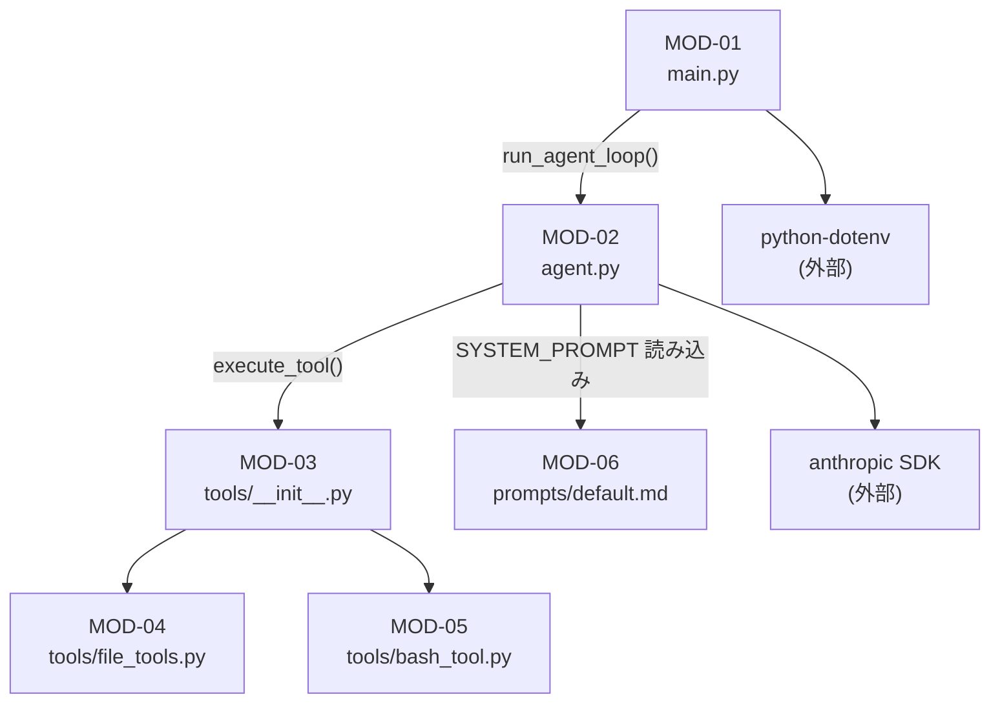
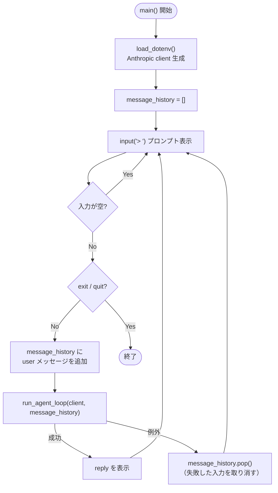
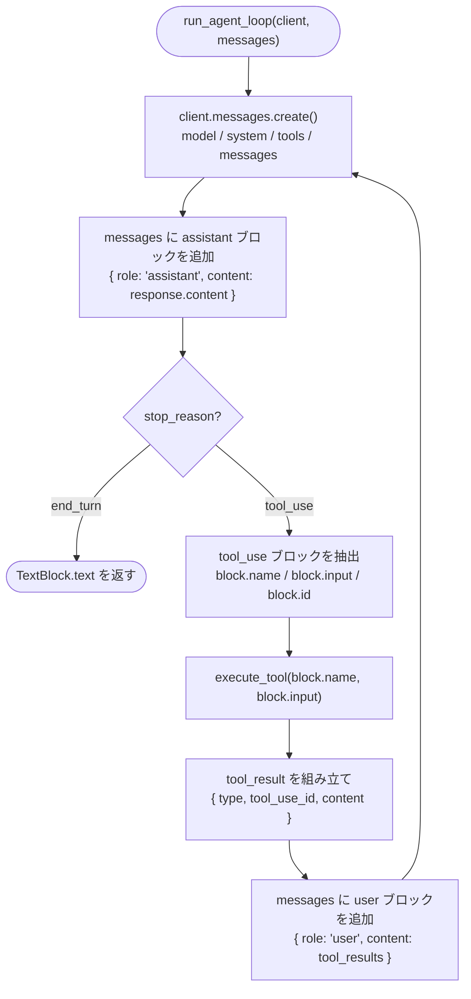
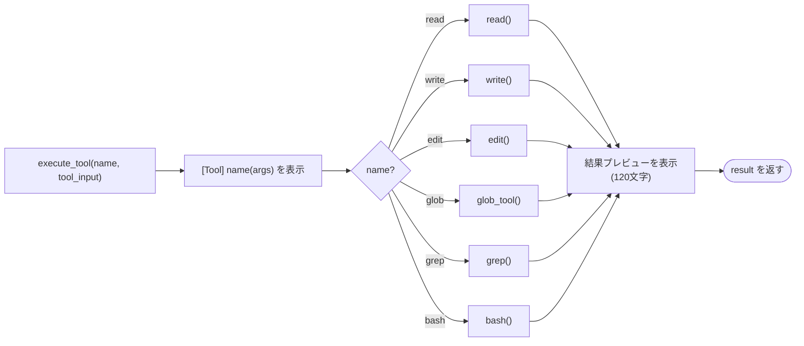
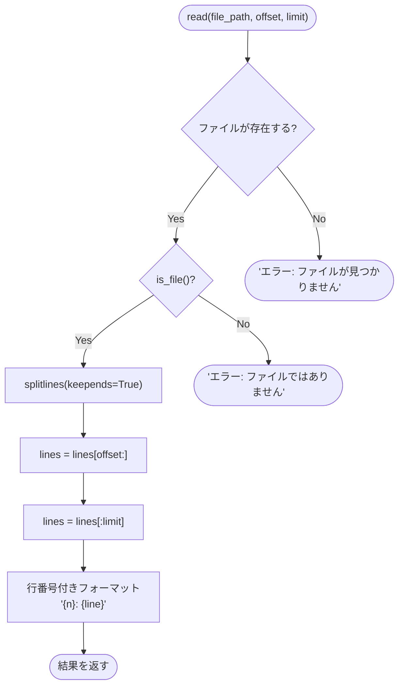
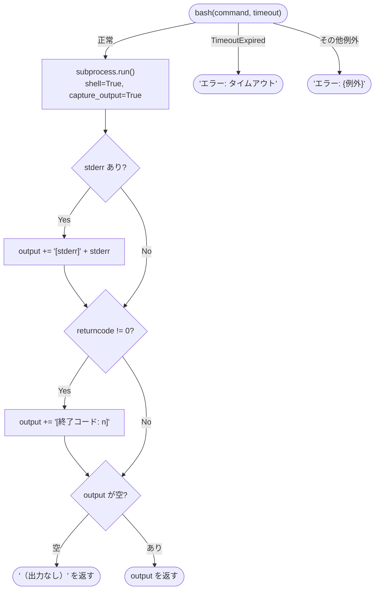

# モジュール設計書: 汎用AIエージェント

**バージョン**: v1.0
**最終更新**: 2026-03-16

## この文書で把握できること

| 問い | 答えが書いてある箇所 |
|------|---------------------|
| モジュール全体の依存関係はどうなっているか？ | §1 モジュール依存関係図 |
| 各モジュールは具体的に何を担当するか？ | 各 MOD セクション「責務」 |
| 他のモジュールに何を公開しているか（API）？ | 各 MOD セクション「公開インターフェース」 |
| モジュール内部の処理はどんな順序で進むか？ | 各 MOD セクション「内部フロー」図 |
| 各モジュールが依存しているものは何か？ | 各 MOD セクション「依存関係」表 |
| アーキテクチャの各要素はどのファイルで実装されるか？ | §2 トレーサビリティ（アーキ→モジュール） |
| 要件・アーキ・実装の対応関係は？ | §3 全体トレーサビリティマトリクス |

> **この文書では扱わないこと**: なぜその設計にしたか（設計判断）はアーキテクチャ設計書を参照。実際のコードはソースファイルを参照。

---

## 1. モジュール一覧

| ID     | モジュール             | サブシステム    | 対応アーキテクチャ要素 |
|--------|------------------------|----------------|------------------------|
| MOD-01 | `main.py`              | UI Subsystem   | §3 UI Subsystem, §4 UI↔AgentCore |
| MOD-02 | `agent.py`             | Agent Core     | §5 Agentic Loop, §6 Tool Use プロトコル |
| MOD-03 | `tools/__init__.py`    | Tool Subsystem | §4 AgentCore↔Tool インターフェース |
| MOD-04 | `tools/file_tools.py`  | Tool Subsystem | §3 Tool Subsystem |
| MOD-05 | `tools/bash_tool.py`   | Tool Subsystem | §3 Tool Subsystem |
| MOD-06 | `prompts/default.md`   | Agent Core     | §7 ADR#4 |

### テストファイル構成

テスト関連ファイルはプロダクションモジュール（MOD）ではないため、別枠で管理する。

| ファイル | 対象モジュール | テスト種別 |
|---------|--------------|----------|
| `tests/test_tools.py` | MOD-04, MOD-05 | ユニットテスト（TC-U-01〜13） |
| `tests/test_agent.py` | MOD-01, MOD-02, MOD-03 | 統合テスト（TC-I-01〜07） |
| `tests/run_tests.py` | — | テスト実行・レポート表示 |

> 詳細は `テスト仕様書兼報告書.md` を参照。

### モジュール依存関係



---

## MOD-01: `main.py`

**対応アーキテクチャ**: §3 UI Subsystem / §4 UI↔AgentCore インターフェース
**対応要件**: REQ-02, REQ-03

### 責務
- 環境変数（API キー）の読み込みと `Anthropic` クライアントの生成
- REPL ループ（入力受付 → Agent Core 呼び出し → 結果表示）
- 会話履歴リスト（`message_history`）の保持

### 公開インターフェース

```
main() → None
```

### 内部フロー



### 依存関係

| 依存先 | 用途 |
|--------|------|
| `agent.run_agent_loop` | Agentic Loop 実行 |
| `anthropic.Anthropic` | API クライアント |
| `dotenv.load_dotenv` | 環境変数読み込み |

---

## MOD-02: `agent.py`

**対応アーキテクチャ**: §5 Agentic Loop / §6 Anthropic Tool Use プロトコル
**対応要件**: REQ-01, REQ-06, REQ-07

### 責務
- Claude API の呼び出し
- `stop_reason` による分岐制御（ループ継続 or 終了）
- `tool_use` ブロックの抽出と Tool Subsystem への委譲
- `tool_result` メッセージの組み立てと履歴への追加

### 公開インターフェース

```
run_agent_loop(client: Anthropic, messages: list) → str
  - client  : anthropic.Anthropic インスタンス
  - messages: 会話履歴リスト（参照渡し。この関数内で追記される）
  - 戻り値  : Claude の最終テキスト回答
```

### 内部フロー



### モジュールレベル定数

```
SYSTEM_PROMPT: str   # prompts/default.md の内容（起動時に読み込み）
```

### 依存関係

| 依存先 | 用途 |
|--------|------|
| `tools.TOOLS` | Claude API に渡すツールスキーマリスト |
| `tools.execute_tool` | ツール実行の委譲先 |
| `prompts/default.md` | システムプロンプト |

---

## MOD-03: `tools/__init__.py`

**対応アーキテクチャ**: §4 AgentCore↔Tool インターフェース
**対応要件**: REQ-04, REQ-05, NREQ-04

### 責務
- ツールスキーマ一覧（`TOOLS`）を Agent Core に提供する
- ツール名から実装関数へのディスパッチ（`execute_tool`）
- ツール呼び出しのコンソール表示（呼び出し名・引数・結果プレビュー）

### 公開インターフェース

```
TOOLS: list[dict]
  - Anthropic API の tools パラメータに直接渡せるスキーマリスト

execute_tool(name: str, tool_input: dict) → str
  - name      : ツール名（例: "read", "bash"）
  - tool_input: Claude が生成した入力パラメータ辞書（block.input）
  - 戻り値    : ツール実行結果の文字列
```

### ディスパッチ構造



### 依存関係

| 依存先 | 用途 |
|--------|------|
| `tools.file_tools` | ファイル操作ツール（スキーマ＋実装） |
| `tools.bash_tool`  | bash 実行ツール（スキーマ＋実装） |

---

## MOD-04: `tools/file_tools.py`

**対応アーキテクチャ**: §3 Tool Subsystem
**対応要件**: REQ-04, NREQ-04

### 責務
ファイル操作ツール5種のスキーマ定義と実装関数を提供する。

### 公開インターフェース

各ツールは `(スキーマ定数, 実装関数)` のペアで構成される。

```
READ_SCHEMA  : dict    / read(file_path, offset=0, limit=0) → str
WRITE_SCHEMA : dict    / write(file_path, content) → str
EDIT_SCHEMA  : dict    / edit(file_path, old_string, new_string) → str
GLOB_SCHEMA  : dict    / glob_tool(pattern, path=".") → str
GREP_SCHEMA  : dict    / grep(pattern, path=".", file_glob="**/*") → str
```

### 各関数の仕様

| 関数 | 引数 | 正常時の戻り値 | エラー時の戻り値 |
|------|------|--------------|----------------|
| `read` | file_path, offset=0, limit=0 | 行番号付きファイル内容 | `"エラー: ..."` |
| `write` | file_path, content | `"書き込み完了: {path} ({bytes} bytes)"` | 例外を送出 |
| `edit` | file_path, old_string, new_string | `"編集完了: {path}"` | `"エラー: ..."` |
| `glob_tool` | pattern, path="." | 改行区切りのパス一覧 | `"一致するファイルが..."` |
| `grep` | pattern, path=".", file_glob="**/*" | `{path}:{行番号}: {行内容}` の一覧 | `"一致する行が..."` |

### read の内部フロー



### 補足仕様

- `write`: 親ディレクトリが存在しない場合は自動作成（`mkdir -p` 相当）
- `edit`: 最初の1箇所のみ置換
- `grep`: 最大100件で打ち切り。バイナリファイルは `errors='replace'` でスキップ

### 依存関係

| 依存先 | 用途 |
|--------|------|
| `pathlib.Path` | ファイルパス操作 |
| `re` | 正規表現（grep） |

---

## MOD-05: `tools/bash_tool.py`

**対応アーキテクチャ**: §3 Tool Subsystem
**対応要件**: REQ-05

### 責務
シェルコマンドの実行ツールのスキーマ定義と実装関数を提供する。

### 公開インターフェース

```
BASH_SCHEMA : dict
bash(command: str, timeout: int = 30) → str
  - command: 実行するシェルコマンド
  - timeout: タイムアウト秒数（デフォルト 30 秒）
  - 戻り値 : stdout + stderr の結合文字列
```

### 内部フロー



### 依存関係

| 依存先 | 用途 |
|--------|------|
| `subprocess` | コマンド実行 |

---

## MOD-06: `prompts/default.md`

**対応アーキテクチャ**: §7 ADR#4
**対応要件**: REQ-04, REQ-05, NREQ-03

### 責務
Claude に渡すシステムプロンプトをコードから分離して管理する。

### 内容構成

| セクション | 目的 |
|-----------|------|
| ツール使用ルール | 宣言だけでなく即座にツールを呼び出させる指示 |
| 回答ルール | 日本語回答、ツール結果を含めることの指示 |

### ロード方法（MOD-02 より）

```python
SYSTEM_PROMPT = (Path(__file__).parent / "prompts" / "default.md").read_text(encoding="utf-8")
```

---

## 2. トレーサビリティ（アーキテクチャ → モジュール）

| アーキテクチャ要素                  | 実装モジュール         |
|-------------------------------------|------------------------|
| §3 UI Subsystem                     | MOD-01 (`main.py`)     |
| §3 Agent Core Subsystem             | MOD-02 (`agent.py`)    |
| §3 Tool Subsystem                   | MOD-03, MOD-04, MOD-05 |
| §4 UI↔AgentCore インターフェース     | MOD-01, MOD-02         |
| §4 AgentCore↔Tool インターフェース   | MOD-02, MOD-03         |
| §5 Agentic Loop                     | MOD-02                 |
| §6 Tool Use プロトコル               | MOD-02, MOD-03         |
| §7 ADR#1（フレームワーク不使用）      | MOD-02（直接 SDK 呼び出し） |
| §7 ADR#2（ファイル単位分離）          | MOD-01〜MOD-05 の分割  |
| §7 ADR#3（スキーマ＋実装ペア管理）    | MOD-04, MOD-05         |
| §7 ADR#4（プロンプト外部管理）        | MOD-06                 |
| §7 ADR#5（messages 参照渡し）        | MOD-01, MOD-02         |

---

## 3. 全体トレーサビリティマトリクス

| 要件ID  | アーキテクチャ要素             | 実装モジュール       |
|---------|-------------------------------|----------------------|
| REQ-01  | §2 技術スタック / §5 Loop     | MOD-02（model 指定） |
| REQ-02  | §3 UI Subsystem               | MOD-01               |
| REQ-03  | §4 UI↔AgentCore / §7 ADR#5   | MOD-01, MOD-02       |
| REQ-04  | §3 Tool Subsystem             | MOD-03, MOD-04       |
| REQ-05  | §3 Tool Subsystem             | MOD-03, MOD-05       |
| REQ-06  | §6 Tool Use プロトコル        | MOD-02, MOD-03       |
| REQ-07  | §5 Agentic Loop（終了条件）   | MOD-02               |
| NREQ-01 | §2 技術スタック               | 全モジュール         |
| NREQ-02 | §2 技術スタック / §7 ADR#1   | `pyproject.toml`     |
| NREQ-03 | §7 ADR#2, #4                 | MOD-02〜MOD-06（コメント）|
| NREQ-04 | §3 Tool Subsystem / §7 ADR#3 | MOD-03, MOD-04, MOD-05 |

---

## 更新履歴

| バージョン | 日付       | 変更内容                                                               |
|-----------|------------|-----------------------------------------------------------------------|
| v1.0      | 2026-03-16 | 初版作成。MOD-01〜MOD-06 の責務・インターフェース・内部フロー・トレーサビリティを定義 |
| v1.1      | 2026-03-17 | read の出力フォーマット記述を `{n}→{line}` から `{n}: {line}` に修正。テストファイル構成セクションを追加 |
